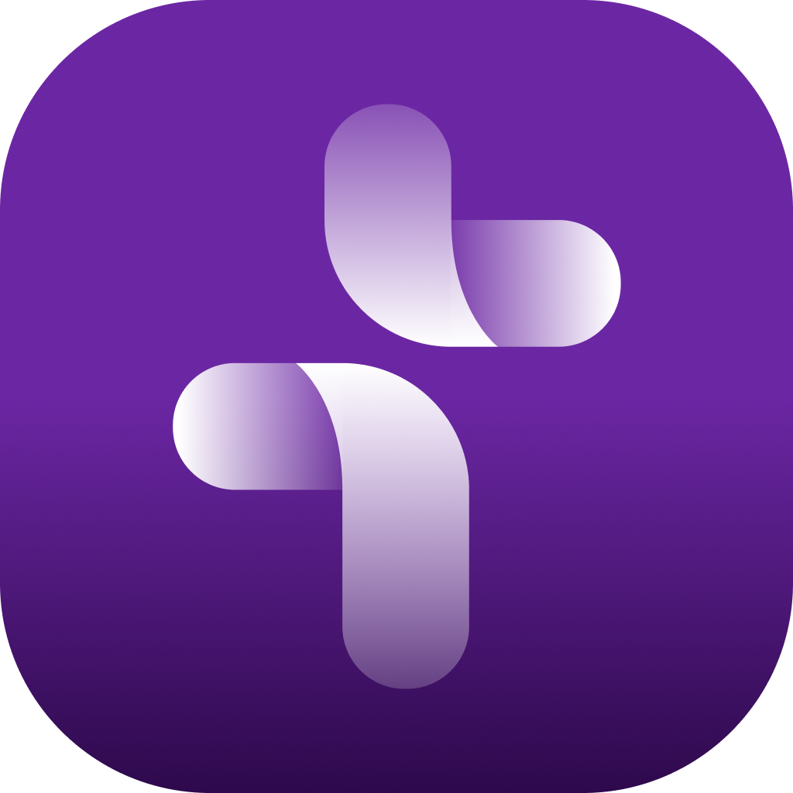
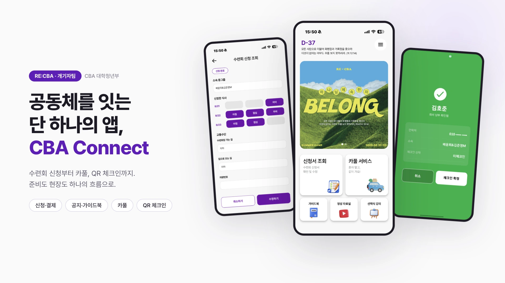
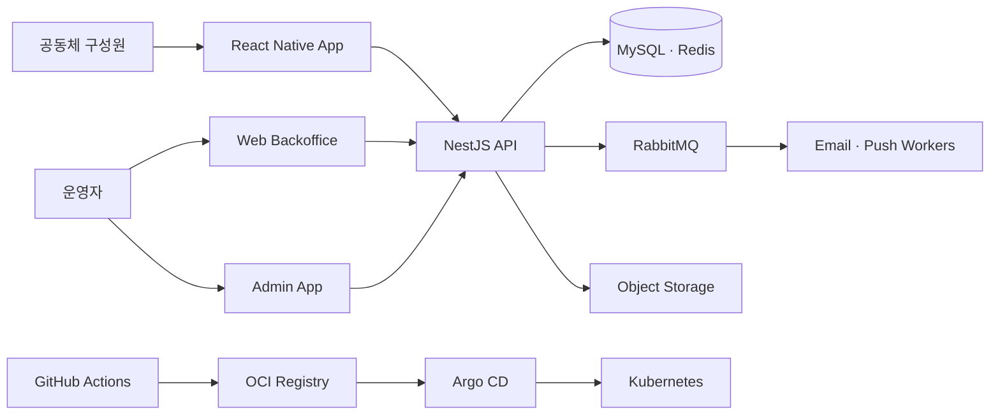
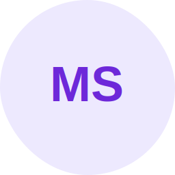

  
  <h1>RE:CBA · 개기자팀</h1>
  
<strong>공동체의 필요를 발견하고, 디지털 플랫폼으로 연결합니다.</strong>

  
Discover · Build · Operate · Improve

  

    
    
  

## We are

**개기자팀**은 성락교회 CBA 대학청년부 공동체 안팎의 문제를 디지털 플랫폼으로 연결하는 스프린트 중심의 팀입니다.

수련회 운영의 작은 불편을 해결하는 모임에서 시작해, 지금은 **CBA Connect**를 직접 만들고 운영하고 있습니다. 개발자만의 팀이 아니라 공동체의 필요를 발견하고, 문제를 정의하고, 디지털로 해결하는 팀입니다.

| Discover | Build | Operate | Improve |
| --- | --- | --- | --- |
| 현장의 필요와 불편을 찾습니다. | 앱, 웹, 서버와 인프라를 만듭니다. | 실제 공동체 행사와 일상에서 운영합니다. | 사용자 피드백과 운영 경험을 다음 개선으로 연결합니다. |

## CBA Connect

  

**CBA Connect**는 공동체의 행사 준비부터 현장 운영까지 하나의 흐름으로 연결하는 플랫폼입니다. 참여자는 필요한 정보를 쉽게 확인하고 신청하며, 운영자는 반복 업무를 줄이고 더 정확하게 현장을 관리할 수 있습니다.

| 영역 | 주요 기능 |
| --- | --- |
| 신청과 결제 | 수련회 및 행사 신청, 식사·교통 옵션, 납부 상태 관리 |
| 안내와 소통 | 공지사항, 가이드북, 푸시 알림, 이메일 인증 |
| 이동과 현장 | 카풀 연결, QR 체크인, 출석 및 신청자 관리 |
| 운영 도구 | 웹 백오피스, 관리자 앱, 대시보드, 계정 및 시스템 설정 |

## Our journey

| 시기 | 변화 |
| --- | --- |
| **2024 Summer** | React 웹 MVP와 Express·Prisma 기반 서버를 구축하고 첫 수련회에서 실제 운영을 시작했습니다. |
| **2024 Winter – 2025 Spring** | 여러 수련회와 행사로 도메인을 확장하고, 신청 내역·가이드북·운영 안정성을 개선했습니다. |
| **2025 Summer** | 모바일 경험을 강화하며 카풀, 채팅, 실시간 기능과 푸시 알림을 도입했습니다. |
| **2025 Winter – 2026** | React Native 앱과 NestJS 서버로 전환하고 Kubernetes 기반 운영 환경과 QR 관리자 앱을 구축했습니다. |
| **Now** | 행사 운영 도구를 넘어 공동체의 일상과 사역을 연결하는 플랫폼으로 확장하고 있습니다. |

## Platform

  
  
  
  
  
  

## Repositories

| Repository | 역할 |
| --- | --- |
| [`cba_connect`](https://github.com/dpcomm/cba_connect) | 구성원이 사용하는 React Native 모바일 앱 |
| [`cba_was_renewal`](https://github.com/dpcomm/cba_was_renewal) | NestJS 기반 API와 이메일·푸시 워커 |
| [`cba_app_management`](https://github.com/dpcomm/cba_app_management) | 행사와 계정을 운영하는 웹 백오피스 |
| [`cba_connect_admin`](https://github.com/dpcomm/cba_connect_admin) | QR 체크인과 현장 운영을 위한 관리자 앱 |
| `cba_infra` | Kubernetes, Argo CD, Terraform 기반 인프라와 GitOps 구성 |

## Members

<table>
  <tr>
    <td align="center" width="20%">
      <a href="https://github.com/Hoooooou-Jun">
         
        <b>김호준</b> 
        팀 리드 · 풀스택 · 인프라 
        @Hoooooou-Jun
      </a>
    </td>
    <td align="center" width="20%">
      <a href="https://github.com/limcr-dev">
         
        <b>임채린</b> 
        모바일 앱 · 프론트엔드 
        @limcr-dev
      </a>
    </td>
    <td align="center" width="20%">
      <a href="https://github.com/Gusq1s">
         
        <b>박현빈</b> 
        백엔드 
        @Gusq1s
      </a>
    </td>
    <td align="center" width="20%">
      <a href="https://github.com/qlqqqk">
         
        <b>전형진</b> 
        풀스택 
        @qlqqqk
      </a>
    </td>
    <td align="center" width="20%">
      <a href="https://github.com/1214sujin">
         
        <b>강수진</b> 
        웹 프론트엔드 
        @1214sujin
      </a>
    </td>
  </tr>
  <tr>
    <td align="center" width="20%">
      <a href="https://github.com/jung-ing">
         
        <b>유정인</b> 
        백엔드 
        @jung-ing
      </a>
    </td>
    <td align="center" width="20%">
       
      <b>이민서</b> 
      UI/UX 디자인
    </td>
    <td align="center" width="20%">
      <a href="https://github.com/anna-choisk">
         
        <b>최슬기</b> 
        서비스 기획 
        @anna-choisk
      </a>
    </td>
    <td align="center" width="20%">
      <a href="https://github.com/lyg010502">
         
        <b>이영광</b> 
        백엔드 
        @lyg010502
      </a>
    </td>
    <td align="center" width="20%">
      <a href="https://github.com/lawproclaim">
         
        <b>국윤령</b> 
        자문 · 팀 지원 
        @lawproclaim
      </a>
    </td>
  </tr>
</table>

## How we work

- 필요한 기능을 작은 스프린트 단위로 나누고, 목적에 맞는 TF를 유연하게 구성합니다.
- 무엇을 만드는지보다 **왜 필요한지**와 원인·결과의 흐름을 먼저 이해합니다.
- 문서와 대화를 통해 맥락을 공유하고, 맡은 결과에 끝까지 책임집니다.
- 실제 사용자의 목소리와 운영 데이터를 다음 제품 결정에 반영합니다.

## What we believe

우리가 만드는 결과물과 일하는 과정에 하나님의 마음이 드러나기를 바랍니다. 사랑과 신뢰로 연합하고, 공동체에 좋은 대안을 제시하며, 서로의 성장을 돕는 팀을 지향합니다.

---

  <strong>Built and operated by RE:CBA · 개기자팀</strong> 
  Connecting people, ministry and everyday community life.

